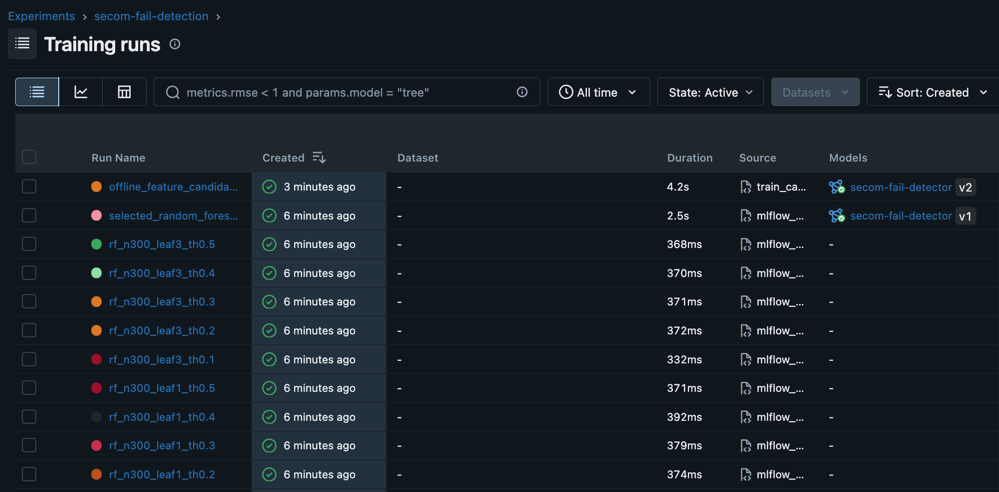
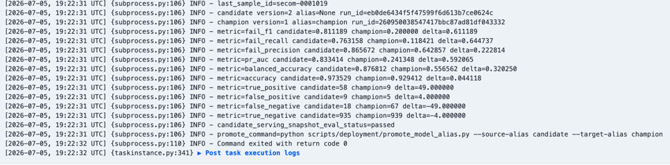
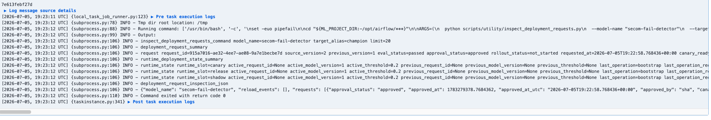

## Prerequisites
```shell
$ mise trust
$ mise install python

# install uv
$ brew install uv

# Install venv and dependencies
$ uv sync
```
- docker desktop or rancher desktop

## Tutorials
### 0. Download `SECOM` data
```shell
$  scripts/utility/download_secom.sh
```


### 1. Start docker-compose
```shell
$ cd container
$ docker-compose build
$ docker-compose up -d

# Reset local state from scratch. This deletes local volumes.
$ docker-compose down -v ; docker-compose up -d
```

### 2. Produce feature, labels, predict requests
```shell
$ cd ..
$ pwd
~/secom-mlops

$ ./scripts/scenarios/scenario2.sh
```
- early, middle, late feature producer, label producer, prediction request producer를 실행합니다.
  - feature drift를 유발하기 위해 초기 record에는 offset이 주어집니다.
- Prediction producer는 complete snapshot이 쌓일 시간을 주기 위해 약 30초 뒤 시작됩니다.
- 중지하려면 터미널에서 Ctrl+C를 누릅니다.

### 3. Access the dashboard.
- http://localhost:3000에 접속하셔서 `Monitoring` dashboard로 접근해주세요.
- Kafka로 메세지는 공급되고 있습니다. 

### 4. Check runtime evidence
- Grafana에서 prediction count, latency, model metrics, Kafka lag가 증가하는지 확인합니다.
- Useful URLs:
  - Grafana: http://localhost:3000
  - Airflow: http://localhost:8081
  - MLflow: http://localhost:5100
  - serving-api health: http://localhost:8080/health
  - model-gateway health: http://localhost:8090/health

### 5. Train a candidate model
- 라벨이 충분히 공급된 이후 작업이 필요합니다. `runtime/online_workload_next_feature_*_state.json`, `runtime/online_workload_next_label_state.json`의 index가 1000 이상인 경우 시도해주세요.  
- Airflow UI에서 `train_candidate_from_offline_point_in_time_features` DAG를 실행합니다.
- Important params:
  - `dry_run`: `False`
  - `recent_minutes`: enough window with predictions, labels, and complete snapshots
  - `min_samples`, `min_fail_samples`, `min_pass_samples`: lower them for a quick demo if needed
- 완료 시, MLflow에 모델이 등록됩니다.


### 6. Evaluate candidate gate
- Airflow UI에서 `evaluate_candidate_serving_snapshot_gate` DAG를 실행합니다.
- Important params:
  - `dry_run`: `False`
  - `candidate_version`: empty이면 MLflow `candidate` alias를 사용합니다.
- 만약 `candidate`가 serving snapshot 평가 기준 현재 `champion`보다 성능이 좋지 않다면, DAG는 성공하지만 배포 준비는 `failed`로 끝이 납니다.
- 정상적으로 종료될 경우, eval_status는 `passed`가 됩니다.



### 7. Record deployment request
- Gate가 통과한 뒤 `record_serving_candidate_deployment_request` DAG를 실행합니다.
- FYI. kubernetes 환경에서는 ArgoCD 등을 이용한 GitOps로 전환 가능합니다.
- Important params:
  - `dry_run`: `False`
  - `approval_status`: `approved`

### 8. Inspect deployment requests
- `record_serving_candidate_deployment_request` DAG가 성공하면 `model_deployment_requests`에 request가 저장됩니다.
- Airflow UI에서 `inspect_deployment_requests` DAG를 실행하거나, 로컬에서 아래 명령으로 확인합니다.
```shell
$ uv run python scripts/utility/inspect_deployment_requests.py
```
- 출력에서 배포할 request_id를 확인합니다.
```shell
  request_id=abcdefg
  source_version=...
  approval_status=approved
  rollout_status=not_started
```
- Airflow UI 실행 결과는 다음과 같습니다. 이곳에서 request id `915a7016-ae32-4ee7-ae08-9a7e1becbe7d`를 얻습니다. 이후에 사용하는 값입니다.



### 9. Deploy candidate to canary
- Airflow UI에서 `deploy_candidate_to_canary` DAG를 실행합니다.
- Important params:
  - `dry_run`: `False`
  - `request_id`: 앞 단계에서 확인한 request_id. 이 값은 필수입니다.

### 10. Shift canary traffic
- Canary runtime에 candidate가 올라간 뒤, `set_model_gateway_canary_traffic` DAG를 실행합니다.
- Recommended demo values:
  - `canary_percent`: `1`, `5`, `10`, `50`, `100`
  - `dry_run`: `False`
- 처음에는 `canary_percent=10` 정도로 시작하고, Grafana에서 prediction volume, latency, model quality, drift 지표를 확인합니다.
- 현재 gateway traffic split은 release/canary 사이에서만 동작합니다. Shadow runtime은 별도 route는 있지만 자동 shadow evaluation path는 아직 미구현입니다.
- Gateway admin API로 결과를 직접 확인할 수도 있습니다.
```shell
$ curl http://localhost:18080/admin/traffic-policy
```


### 11. Inspect traffic policy and deployment state
- Traffic 변경 후 `inspect_deployment_requests` DAG를 다시 실행합니다.
- 또는 로컬에서 아래 명령으로 확인합니다.
```shell
$ uv run python scripts/utility/inspect_deployment_requests.py
```
- 확인할 항목:
  - request_id
  - rollout_status
  - runtime_slot=canary
  - active canary model version / run id
  - gateway canary_percent

### 12. Promote candidate to release
- Canary 결과가 괜찮으면 `promote_candidate_to_release` DAG를 실행합니다.
- Important params:
  - `dry_run`: `False`
  - `request_id`: 앞에서 확인한 request_id
  - `reset_canary_traffic`: `True`
- 이 DAG는 candidate를 release runtime으로 reload하고, MLflow champion alias를 candidate version으로 이동한 뒤, canary traffic을 0%로 되돌립니다.

### 13. Verify release promotion
- Promotion 후 상태를 다시 확인합니다.
```shell
$ uv run python scripts/utility/inspect_deployment_requests.py
```
- 확인할 항목:
  - rollout_status=deployed
  - runtime_slot=release
  - release active model version / run id
  - gateway canary_percent=0
- MLflow UI에서도 champion alias가 새 candidate version으로 이동했는지 확인합니다.
  - http://localhost:5100

### 14. Rollback if needed
- Canary 단계에서 문제가 있으면 `rollback_candidate_canary` DAG를 실행합니다.
- Important params:
  - `dry_run`: `False`
  - `request_id`: `rollback`할 deployment request id
- Release promotion 이후 문제가 있으면 `rollback_release_deployment` DAG를 실행합니다.
- Important params:
  - `dry_run`: `False`
  - `reset_canary_traffic`: `True`
- Rollback 후 다시 확인합니다.
```shell
$ uv run python scripts/utility/inspect_deployment_requests.py
$ curl http://localhost:18080/admin/traffic-policy
```