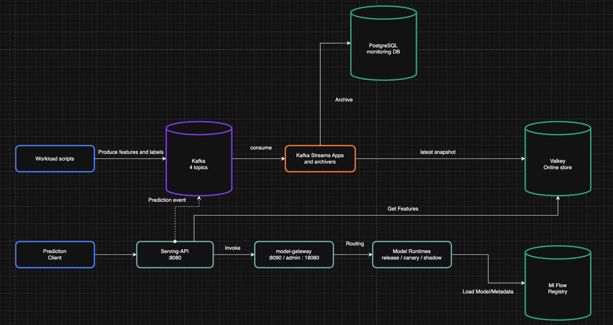
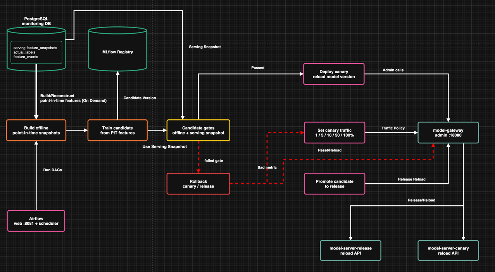
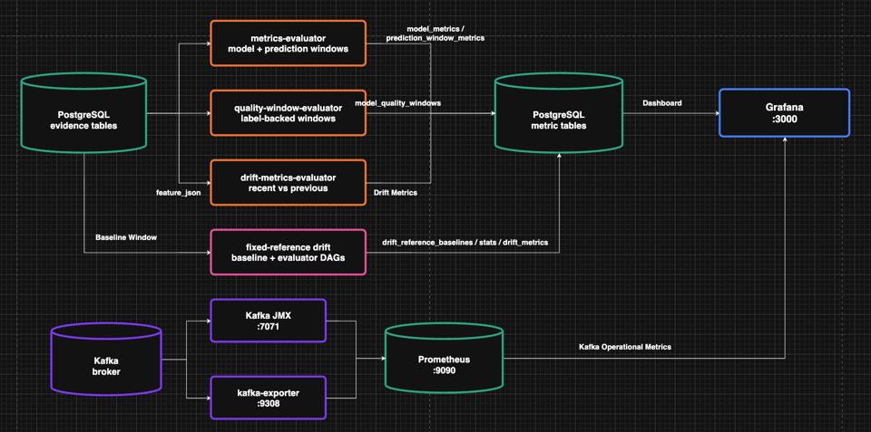

# SECOM / FDC MLOps Platform

반도체 공정 이상 탐지를 대상으로 만든 end-to-end MLOps 플랫폼입니다. 
Kafka 기반 이벤트 파이프라인, Valkey online feature store, FastAPI serving, MLflow model registry, Airflow control plane, Prometheus/Grafana monitoring을 로컬 Docker Compose 환경에서 재현 가능하게 구성했습니다.
이 프로젝트는 ML LifeCycle 관점에서 **feature 수집 -> online serving -> prediction logging -> monitoring -> candidate 학습 -> canary 배포 -> promotion/rollback**까지 이어지는 운영형 ML workflow를 구현하는 것을 목표로 합니다.  

## 핵심 요약

- Kafka topic을 feature patch, feature state update, label event, prediction event로 분리했습니다.
- Kafka streams app과 archiver가 raw feature 저장, feature assembly, snapshot 저장, Valkey materialization을 담당합니다.
- `serving-api`는 Valkey에서 최신 online feature snapshot을 읽고 `model-gateway`를 통해 model runtime을 호출합니다.
- `/predict-by-id` 예측 결과는 best-effort Kafka prediction event로 발행되며, 전달된 이벤트는 `prediction-log-archiver`가 PostgreSQL `prediction_logs`에 저장합니다.
- Airflow DAG가 candidate 학습, gate 평가, canary 배포, traffic split, release promotion, rollback을 제어합니다.
- `build_periodic_training_dataset` DAG는 5분마다 point-in-time readiness를 확인하고, maturity만큼 이동한 Airflow data interval의 versioned training-source dataset을 영속화합니다.
- Candidate 학습은 `serving_feature_snapshots`에서 `available_at` 기준 first-complete snapshot을 선택하고, `label_events` correction history를 cutoff 기준으로 결합합니다.
- Candidate Gate는 release prediction decision으로 평가 Dataset을 먼저 영속화하고, 그 dataset을 다시 불러와 Candidate와 Champion을 비교합니다.
- Grafana는 PostgreSQL metric table과 Prometheus의 Kafka 및 Serving dispatch metric을 함께 시각화합니다.
- Grafana에서 오프라인 학습 데이터와 serving gate를 위한 데이터셋 구축에 필요한 Label Maturity를 10분 단위로 확인할 수 있습니다.

## 현재 범위

- 이 프로젝트는 cloud production deployment가 아니라, 로컬에서 재현 가능한 포트폴리오용 MLOps platform입니다.
- 원본 SECOM 데이터는 총 1,567개 샘플로 구성됩니다. Workload가 생성하는 `sample_id`는 계속 증가하지만, Feature와 Label을 가져오는 `source_row_index`는 `0 ... 1566`을 순환합니다.
  - 따라서 서로 다른 `sample_id`가 동일한 원본 SECOM 샘플의 Feature와 Label을 사용할 수 있습니다.
  - Candidate 학습 cohort와 Serving Gate cohort의 sample ID가 다르더라도 동일한 원본 SECOM 샘플이 양쪽에 포함될 수 있습니다.
- 모델이 원본 1,567개 샘플 전체를 모두 학습하는 상황을 줄이기 위해 Champion과 Candidate의 개발 원본을 최대 1,000건으로 제한합니다.
  - Champion은 원본 SECOM 데이터의 첫 1,000건을 사용합니다.
  - Candidate는 최신 eligible serving snapshot을 최대 1,000건 사용합니다.
- Serving Gate Dataset에는 별도 상한을 두지 않고 지정한 시간 cohort의 전체 release decision을 저장합니다.
- 이 제한만으로 학습과 Gate에서 사용되는 원본 SECOM 샘플이 완전히 분리되지는 않습니다. 이는 현재 반복 시뮬레이션 구조의 한계입니다.

## 기술 스택

| 영역 | 사용 기술                                                   |
| --- |-----------------------------------------------------------|
| Language | Java, Python                                         |
| Streaming | Kafka                                               |
| Stream app | Java, Kafka Streams, Kafka Consumer                |
| Online feature store | Valkey                                   |
| Orchestration | Airflow                                         |
| Model registry | MLflow                                         |
| Serving | FastAPI, Uvicorn, Nginx model-gateway                 |
| Storage | PostgreSQL                                            |
| Monitoring | Prometheus, Grafana, Kafka JMX exporter, kafka-exporter   |
| ML / Python | Python 3.11, uv, pandas, scikit-learn, MLflow             |

## 아키텍처

아키텍처는 세 개의 관점으로 나누어 설명합니다.

| 관점 | 설명 |
| --- | --- |
| Online Serving Path | feature event부터 online prediction과 prediction logging까지의 runtime 경로 |
| MLOps Control Plane | Airflow 기반 candidate 학습, canary 배포, promotion, rollback 흐름 |
| Monitoring Feedback Loop | prediction, label, drift, Kafka metric이 Grafana로 모이는 흐름  |

### Tutorial
실행 방법은 [HOW_TO.md](./HOW_TO.md)를 참고하세요.

## Online Serving Path


Feature online path는 Kafka event를 기준으로 구성됩니다.

```text
Workload scripts
-> secom-feature-patches
-> feature-assembler
-> secom-feature-state-updates
-> feature-materializer
   -> Valkey online_feature_snapshot:{sample_id}
   -> PostgreSQL serving_feature_snapshots
-> serving-api /predict-by-id
-> model-gateway
-> model-server-release / canary 
```
- `feature-materializer`는 Valkey `SET` 성공 후 동일한 snapshot을 PostgreSQL에 저장하고, 두 저장이 모두 끝난 뒤 Kafka offset을 commit합니다.
- Snapshot의 `snapshot_time`은 assembler가 계산한 event time이고, `snapshot_version`은 sample별 state 변경 순서입니다. PostgreSQL의 `available_at`은 해당 version의 Valkey 쓰기가 성공한 뒤 기록되는 online availability time입니다.
- Operational prediction evidence는 `/predict-by-id`가 사용한 `serving_snapshot_id`, `snapshot_version`, `feature_hash`를 포함하며, serving API가 직접 DB에 쓰지 않고 Kafka event로 남깁니다.
- `/predict`는 caller가 feature vector를 직접 전달하는 debug endpoint이므로 operational prediction evidence를 남기지 않습니다.
- Prediction event 발행은 in-memory queue를 이용한 best-effort 방식입니다. Serving API는 Kafka delivery나 PostgreSQL 영속화를 기다리지 않고 예측 결과를 응답합니다.
- In-memory queue 또는 Kafka Producer의 local queue가 가득 차거나, delivery가 실패하거나, 프로세스가 비정상 종료되면 이벤트가 유실될 수 있습니다. 실패한 이벤트를 재시도하거나 복구하는 durable outbox는 현재 제공하지 않습니다.
- 정상 종료 시에는 in-memory queue drain과 Kafka Producer flush를 시도합니다.
- Prediction event와 `prediction_logs`에는 전체 feature vector를 중복 저장하지 않습니다. Feature consumer는 `serving_snapshot_id + sample_id + snapshot_version` logical identity와 `feature_hash` 일치를 확인한 뒤 `serving_feature_snapshots.features_json`을 읽고, 작은 scalar인 `missing_count`는 prediction log에 유지합니다.
- `/predict-by-id` 요청은 Primary와 Shadow runtime으로 fan-out됩니다. 클라이언트는 Primary 결과만 응답받으며, Shadow 결과는 best-effort prediction event로 발행됩니다. Primary와 Shadow를 비교하는 평가 및 메트릭 계산은 후속 범위입니다.


```text
serving-api /predict-by-id
-> secom-prediction-events
-> prediction-log-archiver
-> PostgreSQL prediction_logs
```

- Raw feature patch와 label evidence는 별도 archiver가 PostgreSQL에 저장하고, serving snapshot evidence는 `feature-materializer`가 저장합니다.

```text
secom-feature-patches -> feature-raw-archiver -> PostgreSQL feature_events
secom-label-events    -> label-archiver       -> PostgreSQL label_events
```

- `label_events`는 append-only correction history입니다. `measured_at`은 source가 제공하는 측정 metadata이며, 현재 synthetic workload에서는 label 메시지를 발행하기 직전에 기록합니다. `available_at`은 PostgreSQL에서 label을 관측할 수 있게 된 시각이고, 동일 sample의 `label_revision`이 authoritative correction 순서를 나타냅니다.
- Cutoff 판단에는 `measured_at`이 아니라 `available_at`을 사용합니다.
- Schema와 archiver는 여러 revision을 지원하지만, 현재 기본 workload는 `label_revision=1`만 발행합니다. Correction workload는 후속 범위입니다.

## MLOps Control Plane

- Airflow는 모델 lifecycle을 제어합니다.

```text
Airflow
-> available-time bounded training dataset 구성
-> candidate model 학습
-> MLflow candidate 등록
-> candidate gate 평가
-> canary slot 배포
-> model-gateway canary traffic 조정
-> release promotion 또는 rollback
```

현재 candidate 학습 경로의 중요한 특징은 **available-time bounded dataset 구성**입니다.

```text
PostgreSQL evidence tables
  serving_feature_snapshots
  label_events

-> available-time bounded dataset 구성
-> candidate model 학습
```

현재 main Airflow training path는 `offline_feature_snapshots`를 source로 읽지 않습니다.
별도 utility로 `offline_feature_snapshots`를 저장할 수는 있지만, 실제 candidate 학습 DAG는 PostgreSQL의 immutable serving snapshot과 label history에서 학습 데이터셋을 구성합니다.

학습 시간 계약은 다음과 같습니다.

```text
S = cohort_start_time
T = cutoff_time
L = label_maturity_seconds

sample별 first-complete serving snapshot
AND S <= snapshot.available_at <= T-L

label_events.available_at <= T
-> sample별 max(label_revision)
```

- Feature는 선택된 `serving_feature_snapshots.features_json`을 직접 사용합니다.
- `snapshot_time`과 `measured_at`은 event/measurement metadata이며 availability cutoff가 아닙니다.

### 주기적 Training-source Dataset

`build_periodic_training_dataset` DAG는 5분마다 실행되며 Airflow의 scheduled run에 제공되는 `[data_interval_start, data_interval_end)` 논리적 구간을 label maturity `L`만큼 과거로 이동해 dataset cohort로 사용합니다.
먼저 snapshot/label identity와 시간 metadata만 읽어 readiness를 계산하고, 실제로 새 dataset이 필요한 경우에만 `features_json` 전체를 읽습니다.

```text
S = data_interval_start - L
E = data_interval_end - L

sample별 first-complete serving snapshot
AND S <= snapshot_available_at < E

label_available_at <= data_interval_end
-> sample별 max(label_revision)
```

- Dataset builder에는 1,000개 상한이 없습니다. 시간 범위에 속한 전체 eligible sample을 보존합니다.
- 기본 readiness는 labeled sample 1,000개 이상, label coverage 0.95 이상, fail/pass 각 20개 이상입니다.
- `dataset.parquet`에는 labeled와 unlabeled row가 모두 들어가며 label 컬럼은 nullable입니다.
- Dataset identity는 정확한 snapshot/label membership과 stable selector contract로 계산합니다.
- Artifact는 MLflow `secom-training-datasets` experiment에 `dataset.parquet`, `manifest.json`, `stats.json`으로 저장하고 PostgreSQL `dataset_builds`에 상태와 URI를 기록합니다.
- 같은 MLflow run에 Dataset input metadata를 `training_source` context로 기록합니다. Dataset name은 `dataset_id`, digest는 manifest SHA-256에서 파생하며, target은 nullable `actual_value`입니다. 전체 manifest hash와 artifact URI/hash는 input tag로 연결합니다.
- Readiness 미달은 Airflow `SKIPPED`로 종료합니다. 동일 membership의 READY dataset이 이미 있는 경우에도 artifact를 재생성하지 않고 `SKIPPED`로 종료합니다.

Dataset builder의 지원되는 유일 실행 경로는 Airflow DAG입니다. DAG는 `max_active_runs=1`로 dataset build를 직렬화합니다. 직접 CLI 실행, 다중 writer는 현재 지원 범위에서 제외합니다. Distributed lock이나 lease, active/stale `BUILDING` 판별은 구현하지 않았으며, 후속 Airflow 실행은 기존 non-READY catalog row를 다시 claim할 수 있습니다.
현재 candidate trainer는 이 artifact를 아직 읽지 않고 기존 point-in-time SQL로 직접 개발 원본을 구성합니다. Dataset ID 기반 학습과 labeled row 중 최신 1,000개 선택은 후속 범위입니다.

### Candidate와 Champion의 개발 원본

Candidate는 다음 순서로 개발 원본을 구성합니다.

1. Sample별 first-complete snapshot을 결정합니다.
2. `S <= available_at <= T-L`인 snapshot 중 최신 최대 1,000건을 먼저 선택합니다.
3. 선택된 snapshot에 label을 `LEFT JOIN`하여 실제 `label_coverage`를 계산합니다.
4. Label이 존재하는 row만 모델 개발에 사용합니다.

Main Airflow DAG의 기본 `min_samples=1000`이므로, 기본 실행에서는 1,000건 전체에 label이 있어야 학습이 진행됩니다. `min_samples`를 낮춘 직접 실행에서는 label coverage 조건을 만족하는 더 작은 개발 원본도 사용할 수 있습니다.

모델 선택과 최종 학습 절차는 다음과 같습니다.

| 단계 | Candidate | Champion bootstrap |
| --- | --- | --- |
| 개발 원본 | 최신 eligible serving snapshot 최대 1,000건의 labeled rows | Raw SECOM 원본의 첫 1,000건 |
| 모델 선택 | Stratified 80% 선택 학습 원본 / 20% validation 원본 | Stratified 80% 선택 학습 원본 / 20% validation 원본 |
| 선택 대상 | Hyperparameter와 threshold | Hyperparameter와 threshold |
| 최종 등록 모델 | 선택된 hyperparameter로 전체 labeled 개발 원본 refit | 선택된 hyperparameter로 1,000건 전체 refit |

기본 Candidate 실행에서는 800건의 선택 학습 원본과 200건의 validation 원본을 사용한 뒤 1,000건 전체로 최종 모델을 refit합니다.
최초로 만들어진 Champion은 원본 SECOM의 첫 1,000건으로 학습합니다.
이후 생성되는 Champion은 Serving Gate를 통과해 승격된 이전 Candidate이므로, 각 Champion의 학습 Dataset은 해당 모델의 학습 시점에 따라 달라집니다.
현재 Candidate와 Champion은 학습 Dataset이 아니라 동일한 Serving Gate Dataset에서 평가됩니다.

### Serving Gate 평가 cohort

Serving Gate는 release decision cohort를 구성해 Dataset으로 먼저 영속화한 뒤, 동일한 Dataset을 이용해 candidate/champion 모델 성능을 비교합니다.

1. `runtime_slot='release'`인 prediction만 대상으로 합니다.
2. 동일한 `(sample_id, snapshot_version)`의 반복 요청·재시도 중 `predicted_at`, `prediction_id` 순으로 최초 Decision만 남깁니다.
3. `S <= predicted_at < T-L` 기준으로 중복을 제거한 Decision 전체를 선택합니다. Dataset row 수 상한은 없습니다.
4. `available_at <= T`인 label 중 sample별 최대 `label_revision`을 `LEFT JOIN`합니다.
5. Decision 및 labeled Decision이 각각 1,000건 이상이고 label coverage 0.95 이상, fail/pass가 각각 20건 이상일 때만 Dataset을 만듭니다. 데이터 부족은 영속화하지 않고 Gate task를 실패시킵니다.
6. Exact snapshot identity와 `feature_hash`가 일치하는 complete Feature를 Parquet으로 저장하고 MLflow `secom-serving-gate-datasets` experiment와 PostgreSQL `dataset_builds`에 READY 상태를 기록합니다.
7. 다음 Airflow Task에는 내부 XCom으로 `dataset_id`만 전달합니다. 평가 Task는 READY catalog, manifest hash, artifact SHA-256과 Parquet schema를 검증한 뒤 labeled Decision 중 `predicted_at`, `prediction_id` 기준으로 최신 1,000개를 읽습니다.
8. 평가를 시작할 때 candidate와 champion의 모델 버전을 각각 확인한 후, 동일한 Dataset에 대해 두 모델의 예측 성능을 비교합니다. 두 모델의 run ID가 같으면 Gate를 실패시킵니다. Dataset 생성 구간에 release였던 여러 source model run과 threshold는 row lineage로만 보존합니다.
9. 평가 결과는 MLflow `secom-serving-gate-evaluations` experiment에 별도 evaluation run으로 기록합니다. 이 run에는 사용한 Dataset, candidate/champion의 정확한 model version과 run ID, Gate 기준 및 metric이 포함됩니다.

Snapshot 누락, snapshot identity/hash 불일치, incomplete snapshot, Feature count 불일치 및 artifact 검증 실패는 Gate 오류로 처리합니다. Metric Gate 실패와 데이터 부족도 Airflow task 실패로 연결됩니다.
평가에 적용할 threshold를 운영 중 별도로 변경하는 정책은 현재 범위가 아니며, Dataset에는 당시 release Decision의 `source_threshold`를 보존합니다.
Serving Gate Dataset builder의 지원되는 실행 경로는 Airflow DAG뿐이며, DAG는 `max_active_runs=1`로 실행을 직렬화합니다.
동일한 데이터로 구성된 READY Dataset이 이미 있으면 기존 `dataset_id`를 재사용합니다.
배포 요청은 candidate가 가리키는 최신 `evaluation_run_id`만 사용할 수 있으며, `eval_type=serving_gate_evaluation`으로 기록됩니다. 다른 평가 유형의 요청은 Canary 배포와 Champion 승격에 사용할 수 없습니다. 요청 시점의 candidate가 평가 대상과 다르거나 현재 champion이 평가 당시 champion에서 변경됐다면 재평가가 필요하므로 요청을 거부합니다.

주요 DAG:

```text
train_candidate_from_offline_point_in_time_features
record_serving_candidate_deployment_request
inspect_deployment_requests
evaluate_candidate_serving_snapshot_gate
deploy_candidate_to_canary
set_model_gateway_canary_traffic
promote_candidate_to_release
rollback_candidate_canary
rollback_release_deployment
cleanup_failed_candidate_alias
create_fixed_reference_drift_baseline
fixed_reference_drift_evaluator
refresh_label_maturity_metrics
```

## Monitoring Feedback Loop

- Monitoring은 PostgreSQL evidence table과 Kafka operational metric을 함께 사용합니다.
```text
prediction_logs + label_events
-> scripts/monitoring/evaluate_live_model_quality.py
-> live_model_quality_evaluations

prediction_logs
-> scripts/monitoring/evaluate_prediction_window_metrics.py
-> prediction_window_metrics

prediction_logs
  + serving_feature_snapshots
    logical identity = serving_snapshot_id + sample_id + snapshot_version
    content check = feature_hash
-> drift-metrics-evaluator
-> drift_metrics

prediction_logs
  + serving_feature_snapshots
    logical identity = serving_snapshot_id + sample_id + snapshot_version
    content check = feature_hash
-> fixed-reference drift baseline / evaluator DAGs
-> drift_reference_baselines / drift_reference_stats / drift_metrics

feature snapshots + release predictions + label_events
-> 10분 코호트별 label coverage 계산
-> Airflow에서 1분마다 갱신
-> Grafana Label Maturity 패널
```

### 라벨 도착 속도 모니터링

Label Maturity는 데이터가 준비된 뒤 라벨이 어느 정도 지나야 충분히 모이는지 확인하는 지표입니다. Final label을 별도로 정의하지 않고, 각 sample에 처음 도착한 라벨을 사용합니다.

- Offline Training은 sample별 최초 completed feature snapshot이 준비된 시점부터 라벨 도착 시간을 계산합니다.
- Serving은 release 예측이 발생한 시점부터 라벨 도착 시간을 계산합니다. 같은 예측이 반복 저장된 경우에는 최초 1건만 사용합니다.

관측 대상을 `00:01~00:10`, `00:11~00:20`처럼 고정된 10분 구간으로 묶고, 각 구간에서 0분부터 10분까지 몇 퍼센트의 라벨이 도착했는지 표시합니다. 
아직 진행 중인 구간은 현재까지 확인된 데이터 수만 보여주고, 최종 데이터 수와 미래 시점의 coverage는 비워 둡니다.
10분 구간이 끝나면 대상 수는 확정되지만 라벨 관측은 계속됩니다. 예를 들어 `00:01~00:10` 구간은 `00:11`부터 age 0분을 확인하고, 마지막 대상도 10분을 기다린 `00:21`에 age 10분 관측을 마칩니다. 
따라서 `open`은 대상을 모으는 상태, `observing`은 대상 수가 확정된 뒤 라벨을 기다리는 상태, `complete`는 10분 관측까지 끝난 상태를 의미합니다.

Airflow의 `refresh_label_maturity_metrics` 작업이 이 결과를 1분마다 갱신합니다. 이 모니터링은 Offline Training과 Serving Gate에 사용할 적절한 Label Maturity 시간을 정하기 위한 분석 자료이며, 실제 Gate 설정을 자동으로 변경하지는 않습니다.

Live model quality의 시간 계약은 다음과 같습니다.

```text
T = cutoff_time
L = label_maturity_seconds
W = monitoring_window_seconds
E = T-L
S = E-W
```

- 전체 prediction history에서 `(model_run_id, threshold, sample_id, serving_snapshot_id, snapshot_version)`별 최초 `(predicted_at, prediction_id)`를 선택한 뒤, `S <= predicted_at < E`인 decision만 cohort에 포함합니다.
- Cohort에는 `available_at <= T`인 label 중 sample별 최대 `label_revision`을 `LEFT JOIN`합니다. 따라서 미라벨 decision도 `n_decisions`와 `label_coverage`에 남습니다.
- `(model_run_id, threshold)`별로 evaluation wide row 하나를 append합니다. Cohort/count/status/confusion은 항상 기록하고 scalar quality metric은 `evaluation_status='ok'`일 때만 기록합니다.
- `model_metrics`는 offline evaluation 결과용으로 유지되며, 해당 reader의 `label_events` 전환은 후속 작업입니다.
- `evaluate_drift_metrics.py`, `create_drift_reference_baseline.py`, `evaluate_fixed_reference_drift_metrics.py`는 logical identity와 `feature_hash`를 함께 확인해 serving snapshot의 feature vector를 읽습니다. `prediction_logs`는 feature vector 대신 실제 inference에 사용한 snapshot reference와 hash를 보관합니다.
- Kafka 운영 지표와 Serving API의 Release/Shadow prediction dispatch 지표는 Prometheus를 거쳐 Grafana로 들어갑니다.

## Runtime Services

로컬 stack은 `container/docker-compose.yml`에 정의되어 있습니다.

| 서비스 | 역할 | 로컬 포트 |
| --- | --- | --- |
| PostgreSQL | monitoring DB, MLflow DB, Airflow DB | `5432` |
| Kafka | event backbone | `9092` |
| Valkey | online feature store | `6379` |
| MLflow | tracking server / registry | `5100` |
| Airflow webserver | control plane UI | `8081` |
| serving-api | online prediction API | `8080` |
| model-gateway | model runtime gateway | `8090` |
| model-gateway admin | traffic/reload admin API | `18080` |
| model-server-release | release runtime | `28091` |
| model-server-canary | canary runtime | `28092` |
| model-server-shadow | shadow runtime | `28093` |
| Prometheus | metric store | `9090` |
| Grafana | dashboard | `3000` |
| kafka-exporter | Kafka consumer lag metric | `9308` |

Stream app과 daemon:

```text
feature-raw-archiver
feature-assembler
feature-materializer
label-archiver
prediction-log-archiver
metrics-evaluator (prediction window + live model quality)
drift-metrics-evaluator
```

## 주요 데이터

PostgreSQL 주요 table:

| 분류 | Tables |
| --- | --- |
| Evidence | `feature_events`, `serving_feature_snapshots`, `label_events`, `prediction_logs` |
| Optional offline utility | `offline_feature_snapshots`, `offline_prediction_logs` |
| Offline evaluation | `model_metrics` |
| Monitoring | `live_model_quality_evaluations`, `prediction_window_metrics`, `drift_metrics` |
| Label maturity | `label_maturity_cohort_age_metrics` materialized view |
| Drift baseline | `drift_reference_baselines`, `drift_reference_stats` |
| Deployment state | `model_deployment_requests`, `model_runtime_deployment_state`, `model_runtime_reload_events` |

Kafka topics:

```text
secom-feature-patches
secom-feature-state-updates
secom-label-events
secom-prediction-events
```

## 설계 포인트

### Event evidence 중심 설계
Feature patch, label, prediction을 event evidence로 남긴 뒤, monitoring과 candidate 학습이 이를 읽는 구조입니다. 
Serving 결과를 재현하고, 특정 시점의 feature 상태를 다시 구성할 수 있습니다.
Operational prediction evidence는 `/predict-by-id` 요청만을 대상으로 하며, 각 행의 `serving_snapshot_id`, `snapshot_version`, `feature_hash`가 실제 사용한 serving snapshot과 feature content를 가리킵니다. `/predict`는 debug 용도라 이 evidence 흐름에 포함되지 않습니다.

### Online store와 durable store 분리
Valkey는 online serving에 필요한 최신 feature snapshot만 보관합니다. 
PostgreSQL은 feature, label, prediction, metric, deployment state를 보관하는 durable evidence store 역할을 합니다.

### Available-time 기반 학습 데이터셋 구성
Candidate 학습은 현재 `offline_feature_snapshots`를 source로 삼지 않고 아래 table을 읽어 cutoff 당시 사용할 수 있었던 데이터셋을 구성합니다.
이 방식은 training 시점의 feature/label 누수를 줄이고, online serving에서 실제로 materialize된 snapshot을 기준으로 학습하기 좋습니다.
```text
serving_feature_snapshots
label_events
```
- Feature는 `S <= available_at <= T-L`인 first-complete snapshot을 사용하고, label은 `available_at <= T`인 revision 중 가장 높은 revision을 사용합니다.

### Gateway 기반 release control
Airflow는 model runtime을 직접 조작하지 않고 `model-gateway` admin API를 호출합니다. 
Gateway는 release, canary, shadow runtime으로 traffic을 분리하고 reload를 제어합니다.
Serving API는 `/predict-by-id` 요청을 Shadow runtime으로 고정 fan-out하지만, Shadow 평가와 이를 이용한 배포 제어는 아직 구현하지 않았습니다. 비율 기반 traffic 조절은 현재 release와 canary 사이에서만 수행합니다.

### Monitoring feedback
Prediction/label evidence에서 T/L/W 기반 live model quality와 prediction-window metric을 계산하고, snapshot evidence에서는 drift metric을 계산합니다. Live quality는 `live_model_quality_evaluations` wide row로 append되며 Grafana는 status/coverage와 metric을 함께 표시합니다.
이 시그널은 canary promotion과 rollback 판단 자료로 활용할 수 있습니다.

## Repository Map

```text
airflow/dags/                         Airflow DAG definitions
container/docker-compose.yml           Local MLOps stack
container/nginx/                       model-gateway config and admin API
container/postgres/monitoring-schema.sql
                                      PostgreSQL monitoring schema
feature-raw-archiver/                  Kafka -> feature_events
fdc-feature-assembler/                 feature patch aggregation
fdc-feature-materializer/              Kafka -> Valkey + serving_feature_snapshots
label-archiver/                        Kafka -> label_events
prediction-log-archiver/               Kafka -> prediction_logs
secom_mlops/datasets/                  versioned dataset contract and persistence
secom_mlops/serving/                   serving API and model runtime
scripts/datasets/                      scheduled dataset CLI entry points
scripts/training/                      candidate training scripts
scripts/monitoring/                    prediction-window, live-quality, offline-model, drift evaluators
scripts/deployment/                    deployment and rollback helpers
scripts/workload/                      local workload generators
```
